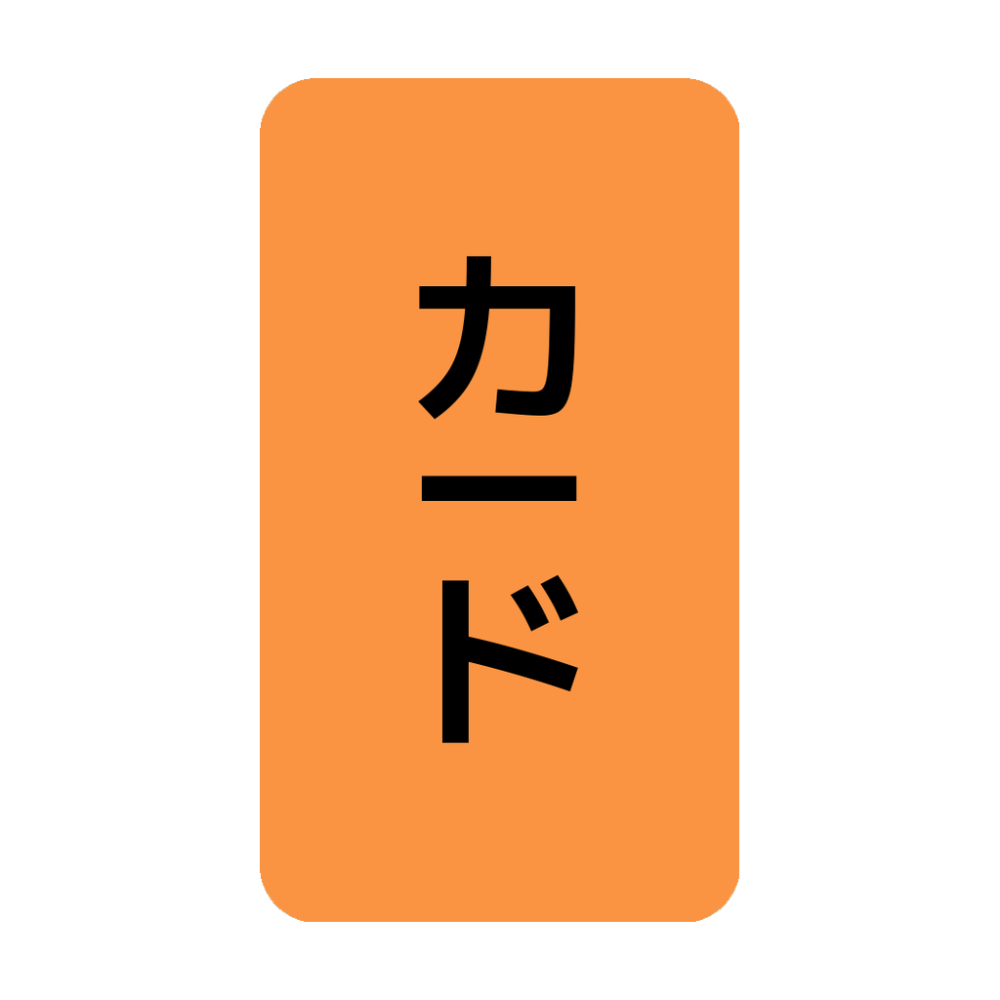
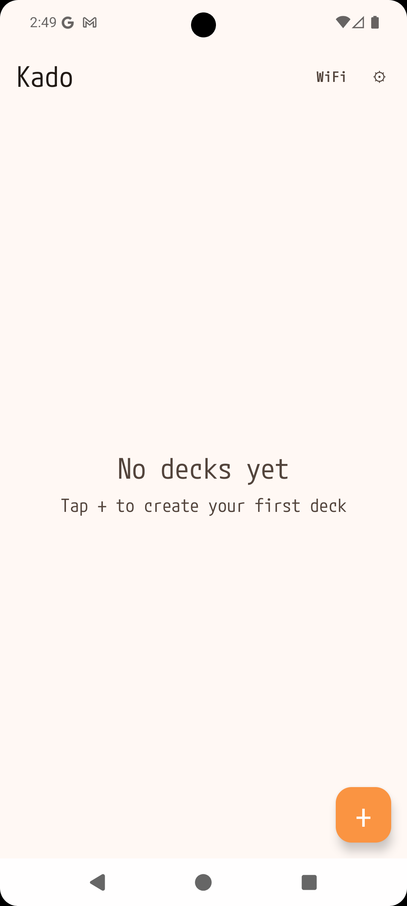
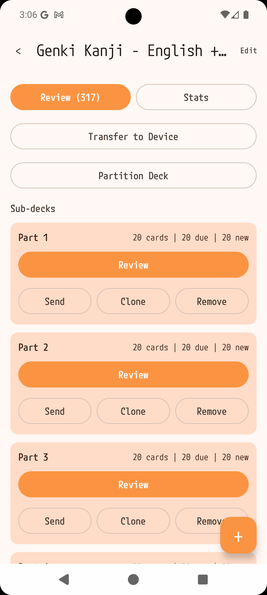
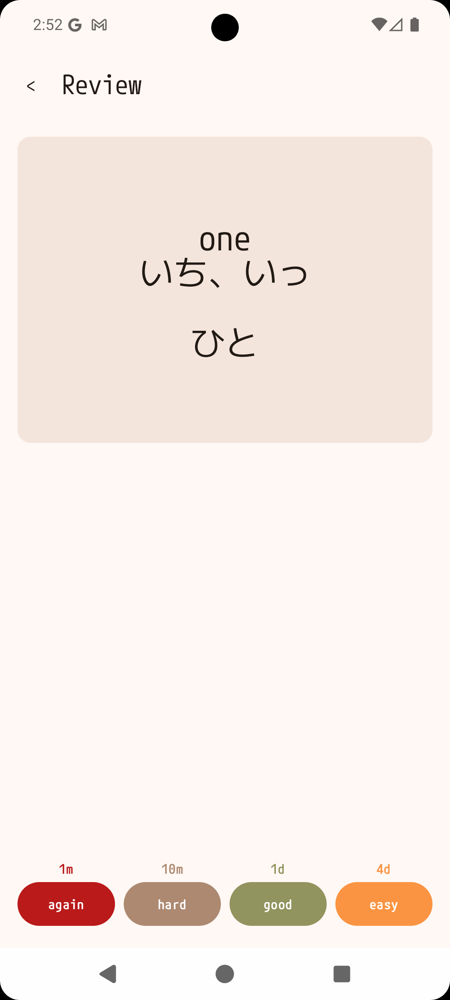
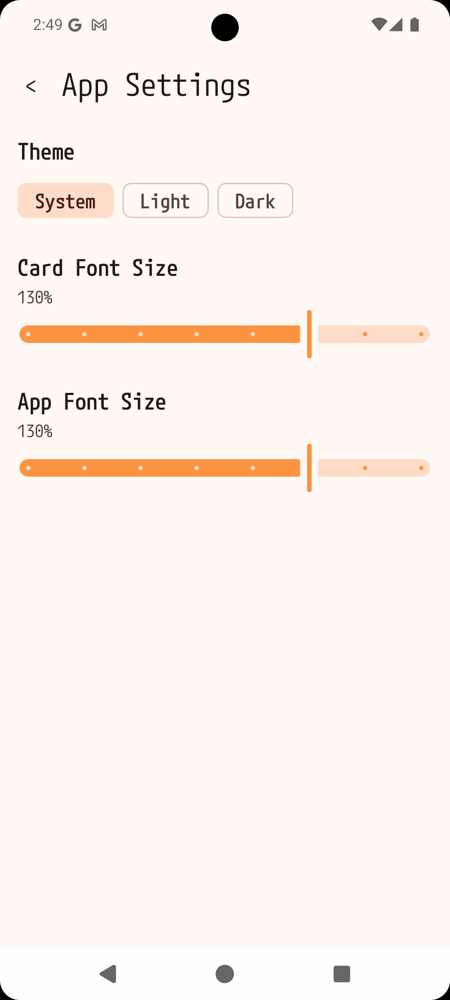

<p align="center">
  
</p>

<p align="center">
  
  
  
  
</p>

<p align="center">
  <video src="screenshots/demo.webm" width="300" autoplay loop muted playsinline>
    Your browser does not support the video tag.
  </video>
</p>

# Kado

Kado is an open-source spaced repetition flashcard app built with Kotlin Multiplatform for Android and iOS. It helps you learn and retain knowledge using your choice of SM2 or FSRS scheduling algorithms, with support for rich text cards, Anki deck imports, and a companion ESP32 hardware device.

## Features

**Spaced Repetition & Review**
- SM2 and FSRS scheduling algorithms with per-deck selection
- Four-button rating system (Again / Hard / Good / Easy) with interval preview
- 3D card flip animation with crossfade content transitions

**Deck Management**
- Create and manage flashcard decks with daily new card limits
- Deck partitioning — split large decks into sub-decks for focused study
- Deck cloning and reversed deck creation
- Bulk editing with saved find/replace rules (plain text and regex)

**Card Content**
- Rich text / HTML rendering (bold, italic, colors, headings, lists)
- Image support in cards
- Adjustable card font scaling
- Import Anki `.apkg` decks with template rendering and media extraction

**Customization & Platform**
- Dark and light themes
- Localization (English, Spanish)
- Text-to-speech for card pronunciation (Android)
- Tablet-friendly layout
- Kotlin Multiplatform — shared logic across Android and iOS

**Analytics & Hardware**
- Learning statistics — track review progress, card states, and retention
- Sync decks to an [ESP32 hardware device](docs/esp32-guide.md) over WiFi

## Documentation

- [Getting Started](docs/getting-started.md) — Installation, creating decks, reviewing cards
- [Feature Reference](docs/features.md) — Detailed documentation for all features
- [ESP32 Hardware Guide](docs/esp32-guide.md) — Device setup, communication protocol, .ald format

## Download

### Stores
<a href="https://play.google.com/store/apps/details?id=com.eldiem.kado.app">

</a>

**Coming Soon**


You can download the latest Android APK from the [Releases](https://github.com/LisandroDiMeo/kado-app/releases) page.

iOS builds require building from source via Xcode (see below).

## Building from Source

### Android

```shell
./gradlew :androidApp:assembleDebug
```

### iOS

Open the `iosApp/` directory in Xcode and run from there.

## Project Structure

| Directory | Purpose |
|---|---|
| `composeApp/` | Shared KMP module (commonMain + platform actuals) |
| `androidApp/` | Android app entry point |
| `iosApp/` | iOS Xcode project |

## ESP32 Hardware Module

Kado supports syncing flashcard decks to an ESP32-based hardware device for offline review. See the [ESP32 Hardware Guide](docs/esp32-guide.md) for the device communication protocol, `.ald` format specification, and setup instructions.

## Support the Project

If Kado is useful to you, consider supporting its development:

<p align="center">
  <a href="https://github.com/sponsors/lisandrodimeo">
    
  </a>
  <a href="https://ko-fi.com/lisandrodimeo">
    
  </a>
  <a href="https://cafecito.app/eldiem-dev">
    
  </a>
</p>

## License

This project follows GLP v3. See the [LICENSE](LICENSE) file for details.
